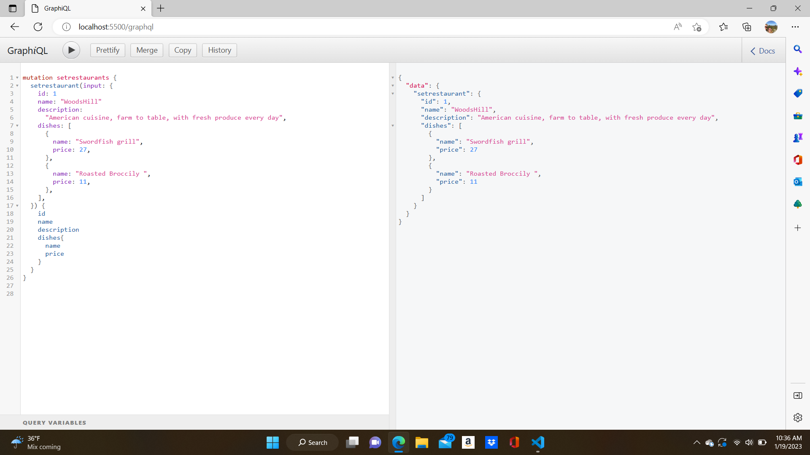
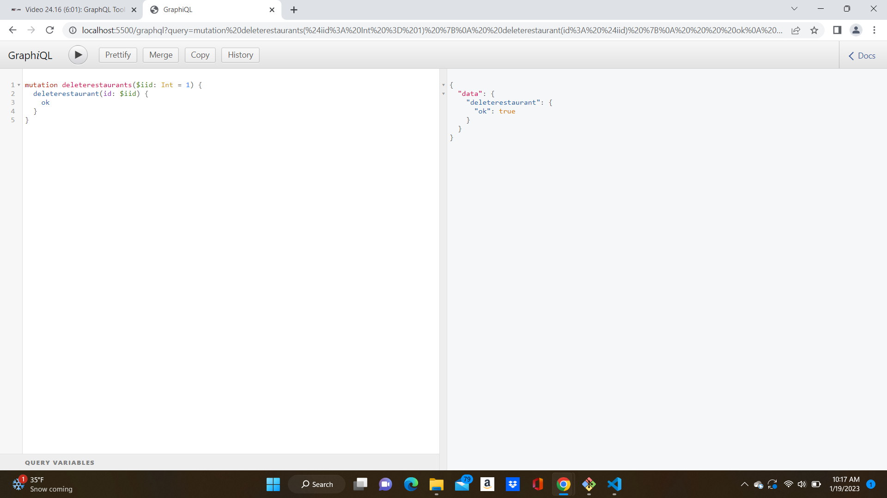

# GraphQL Queries

The following code is a great way to play around with <b> adding, deleting </b> and <b> editing</b> data within a given context.

## Mutation

In order to alter data through GraphQL, one must <i>mutate</i> it:

<b>Adding </b> or <b>setting</b> data:

The function setrestaruant takes in the entirety of the data fields as input. All input fields must be recognizable and defined as value types (String, Int, Boolean...) in the <i>restaurantInput input type</i> of the schema in order to be available for manipulation within the GraphQL environment.

In the case of deletion, the <b>deleterestuarant</b> corresponds with it's functionality found in index.js.  The function takes in the restaurant's unique ID as parameter and returns a boolean value (true = OK) to confirm the restaurant has been deleted properly.
